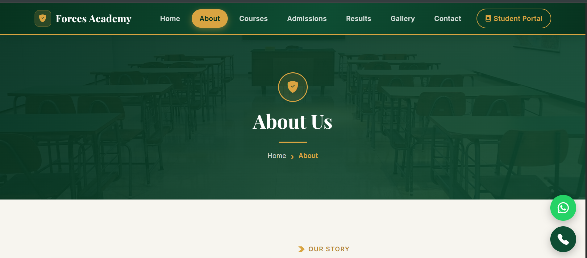
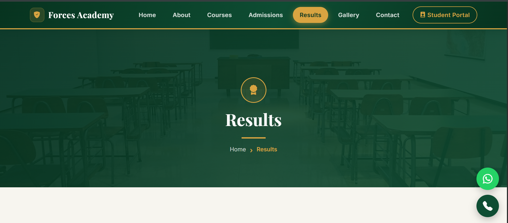

# 🛡️ Forces Academy Faisalabad — Website

A complete, responsive multi-page website built for **Forces Academy Faisalabad**, a defence forces preparation academy offering Army, Air Force & Navy entry-test coaching, ISSB interview grooming, and academic (Matric/FSc) programs in Faisalabad, Pakistan.

This project was built as part of the **Code Saviours SI-26** internship program (Frontend Track), covering real-world frontend development: multi-page architecture, responsive design, interactive UI components, and client-side data handling — all without a backend, using static HTML/CSS/JS + Bootstrap 5.

---

## 🔗 Live Site

**[View Live Website →](https://2024-bs-cs-189-jpg.github.io/forces-academy-HaramAtif-si26/)**

---

## 📸 Screenshots

## 📸 Screenshots

| Home Page | About Page | Results Page |
|---|---|---|
|  |  |  |

> 📁 Screenshots are stored in the `/images` folder in the project root.

---

## 🧰 Tech Stack

- **HTML5** — semantic, multi-page structure (7 pages)
- **CSS3** — custom stylesheet (`CSS/style.css`) with CSS variables, responsive breakpoints (1440px / 768px / 375px), and animations
- **Bootstrap 5.3** — grid system, components (navbar, accordion, carousel, forms)
- **Bootstrap Icons** — iconography throughout the site
- **JavaScript (Vanilla)** — no frameworks; all interactivity hand-written (`js/main.js`)
- **Google Fonts** — Playfair Display (headings) + Inter (body text)
- **GLightbox** — lightbox gallery viewer (Gallery page)
- **GitHub Pages** — static site hosting

---

## ✨ Features

**Site-wide**
- Fully responsive design (tested at 375px / 768px / 1440px)
- Sticky navbar with active-page highlighting and a visually distinct **Student Portal** button (gold outline pill) that shows a "Coming Soon" popup on click
- Floating WhatsApp & Call quick-contact buttons
- Smooth scroll behavior + floating "Back to Top" button
- Page fade-in and scroll-reveal animations on all sections
- Custom inline SVG favicon

**Home**
- Hero section with CTA buttons
- Animated stats counter (students, years, courses, success rate)
- Selection process step tracker + scrolling course ticker
- Testimonials carousel with custom-styled navigation arrows and dots
- "Next Batch Starts In" live countdown timer

**About**
- Academy history timeline (2011–2026)
- Mission & Vision cards
- Achievements/awards grid
- Leadership team profiles

**Courses**
- Course cards grid with tags
- Side-by-side course comparison table
- Batch timing selector (Morning/Evening/Weekend) with live result panel

**Admissions**
- Step-by-step "How to Apply" guide
- Eligibility criteria cards
- Live seat availability progress bars
- Interactive document checklist tracker (saves progress via `localStorage`)
- Full fee structure table
- Important dates timeline

**Results**
- Summary stat cards (total, selected, qualified, success rate)
- Top position holders showcase with photos and a gold highlight for 1st place
- Year-on-year batch comparison bars (2026 vs 2025 vs 2024 vs 2023 batches)
- Searchable & filterable results table (by name, course, year, status)
- Export to CSV + print-friendly view

**Gallery**
- Category filter tabs (Events / Sports / Academic) with live counts
- Live caption search
- Grid/List view toggle
- "Surprise Me" random photo shuffle
- Like button per photo
- Lightbox full-size photo viewer (GLightbox)

**Contact**
- Contact info cards
- Live "We're Online/Offline" status badge (based on office hours)
- Validated contact form with success confirmation
- Static "Open in Google Maps" card (kept lightweight — no embedded iframe, so the page loads in a single request)
- Office hours table
- Contact-specific FAQ accordion

---

## 📁 Project Structure

```
forces-academy-HaramAtif-si26/
├── index.html
├── about.html
├── courses.html
├── admissions.html
├── results.html
├── gallery.html
├── contact.html
├── CSS/
│   └── style.css
├── images/
│   ├── home.html.png
│   ├── about.html.png
│   └── result.html.png
├── js/
│   └── main.js
└── README.md
```

---

## 🚀 Running Locally

1. Clone the repo:
   ```bash
   git clone https://github.com/2024-bs-cs-189-jpg/forces-academy-HaramAtif-si26.git
   ```
2. Open `index.html` directly in your browser, **or** serve it with a local server (recommended, avoids CORS/localStorage quirks):
   ```bash
   npx serve .
   ```
3. Navigate between pages using the navbar.

---

## 👤 Built By

**Built by:** Haram Atif  
**Code Saviours SI-26 | 2026**