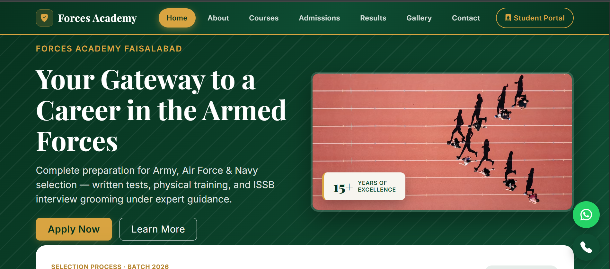
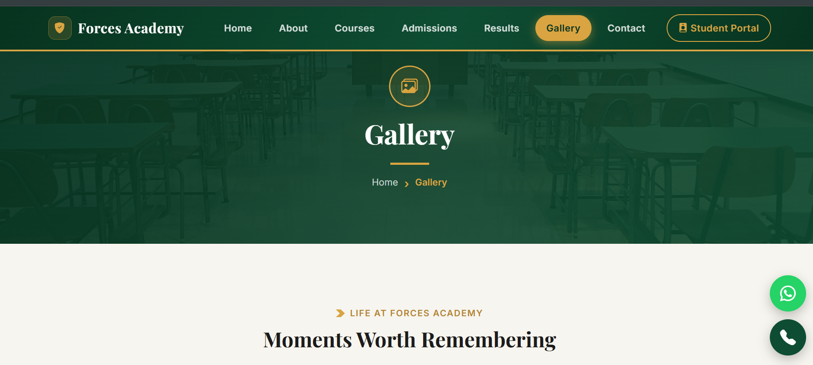

# Forces Academy Faisalabad — Website

A responsive, multi-page website for **Forces Academy Faisalabad**, a defence-forces coaching academy in Faisalabad, Pakistan — built with HTML5, CSS3, Bootstrap 5, and vanilla JavaScript, featuring a custom green-and-gold design system, full dark mode, and real email delivery via EmailJS (no backend server).

---

## Live Site

- **Website:** [https://2024-bs-cs-189-jpg.github.io/forces-academy-HaramAtif-si26/](https://2024-bs-cs-189-jpg.github.io/forces-academy-HaramAtif-si26/)
- **Student Portal (LMS):** [https://forces-academy.infy.click/](https://forces-academy.infy.click/) *(built by the Full Stack track teammate)*

---

## Screenshots

| Home Page | About Page |
|---|---|
|  |  |

| Results Page | Gallery Page |
|---|---|
|  |  |

---

## Tech Stack

- **HTML5** — semantic, multi-page structure (7 pages)
- **CSS3** — custom stylesheet with CSS variables, responsive breakpoints (1440px / 768px / 375px), and animations
- **Bootstrap 5.3** — grid system and components (navbar, accordion, carousel, forms)
- **Bootstrap Icons** — iconography throughout the site
- **JavaScript (Vanilla)** — no frameworks; all interactivity hand-written
- **EmailJS** — sends real emails from the Admissions enquiry form directly from the browser
- **GLightbox** — lightbox photo viewer on the Gallery page
- **Google Fonts** — Playfair Display (headings) + Inter (body text)
- **GitHub Pages** — deployment and hosting

---

## Features

- Fully responsive design for desktop, tablet, and mobile
- Custom green-and-gold defence-academy color theme, with a complete dark mode (saved via `localStorage`)
- Sticky navbar with active-page highlighting and a responsive mobile menu
- Animated hero section, scroll-reveal entrance animations, and animated statistics counters
- Latest Announcements section and testimonials carousel on the homepage
- Course cards with a side-by-side comparison table
- Full admissions flow: eligibility, live seat availability, a document checklist tracker, and a fee structure table
- **Live admission enquiry form that sends real email via EmailJS** — no backend required
- Searchable, filterable results table with CSV export and a print-friendly view
- Campus gallery with category filters, live search, grid/list toggle, and a lightbox viewer
- Contact page with a live "We're Online / Offline" status badge based on real office hours
- Consistent navbar and footer, SEO-friendly meta information, and a custom SVG favicon across all pages

---

## Responsive Design

Tested at three breakpoints — **375px** (mobile), **768px** (tablet), and **1440px** (desktop). The navbar collapses into a hamburger menu and grids reflow to a single column on smaller screens.

---

## Website Pages

| Page | Description |
|---|---|
| **Home** | Hero section, animated stats, announcements, testimonials, batch countdown |
| **About** | Academy history timeline, mission & vision, achievements, leadership team |
| **Courses** | Course cards, comparison table, batch-timing selector |
| **Admissions** | Eligibility, seat availability, document tracker, live enquiry form (EmailJS), fees |
| **Results** | Top achievers, batch comparison, filterable results table, CSV export |
| **Gallery** | Filterable, searchable photo gallery with lightbox viewer |
| **Contact** | Contact info, live office-hours status badge, contact form, FAQ |

---

## Project Structure

```
forces-academy-HaramAtif-si26/
├── index.html
├── about.html
├── courses.html
├── admissions.html
├── results.html
├── gallery.html
├── contact.html
├── CSS/
│   └── style.css
├── images/
│   ├── home.png
│   ├── about.png
│   ├── results.png
│   ├── admissions.png
│   ├── contact.png
│   ├── courses.png
│   └── gallery.png
├── js/
│   └── main.js
└── README.md
```

---

## Running Locally

```bash
git clone https://github.com/2024-bs-cs-189-jpg/forces-academy-HaramAtif-si26.git
cd forces-academy-HaramAtif-si26
```

Open `index.html` directly in your browser, or serve it locally (e.g. the VS Code Live Server extension) for the best experience.

**EmailJS:** the Admissions form is wired to this project's own EmailJS account. To reuse the form elsewhere, create a free account at [emailjs.com](https://www.emailjs.com/) and swap in your own public key, service ID, and template ID inside `admissions.html`.

---

## Built By

**Haram Atif**
Code Saviours — SI-26 Frontend Track | 2026